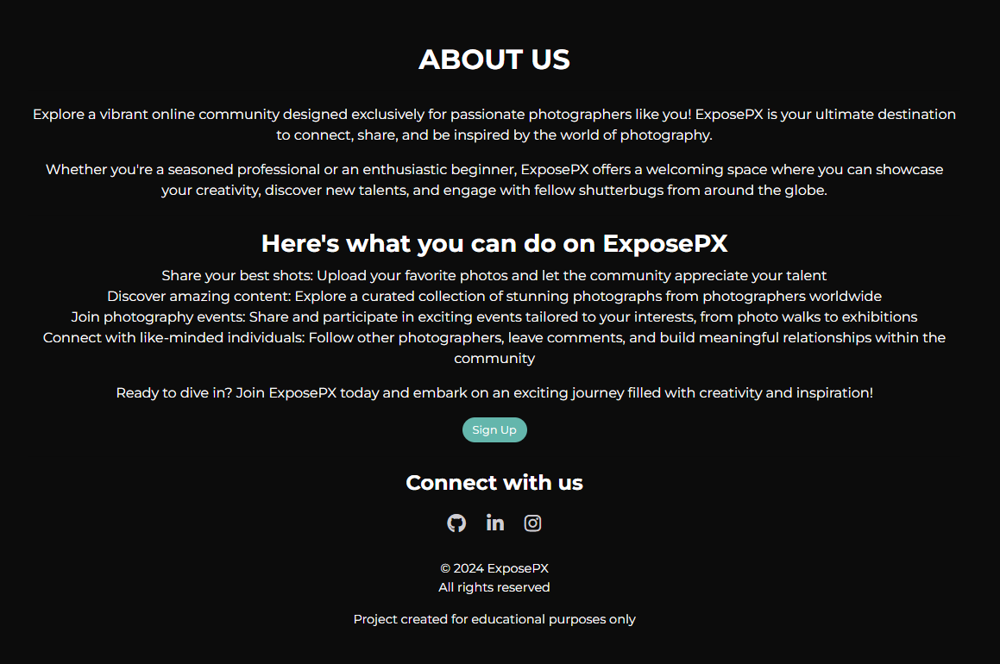
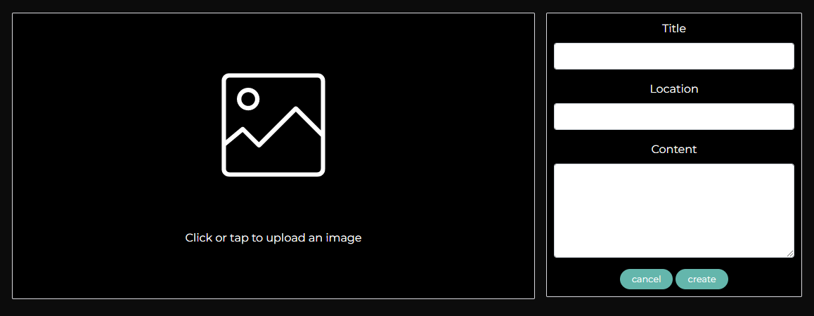
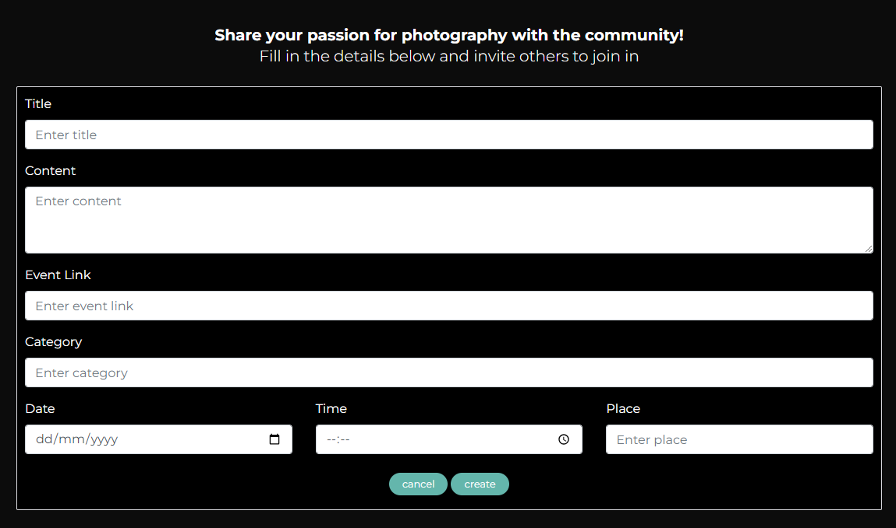
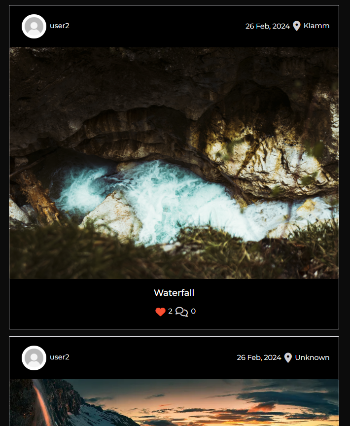
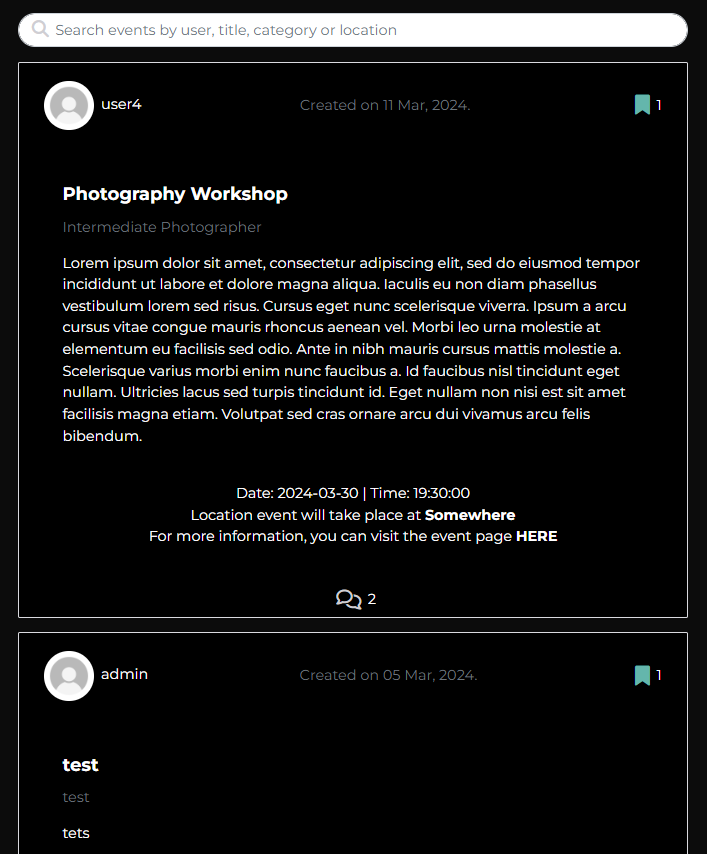
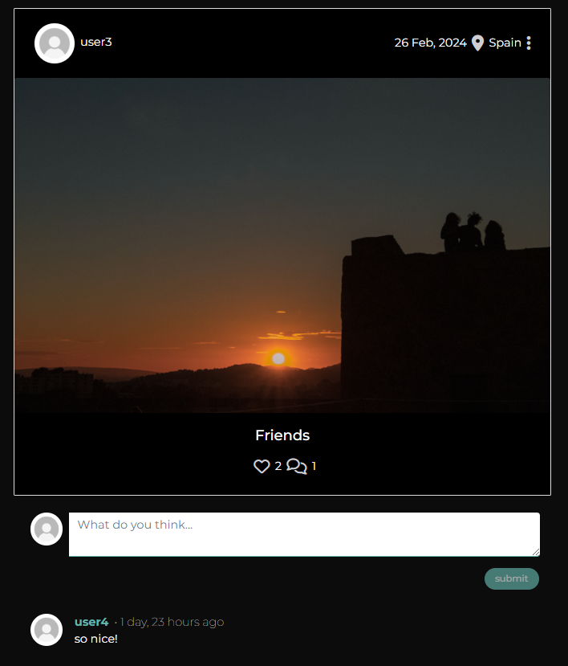
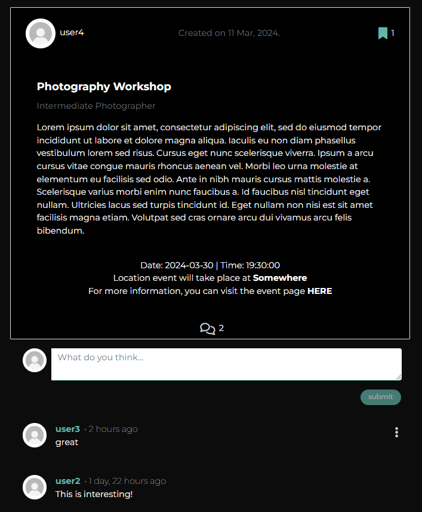
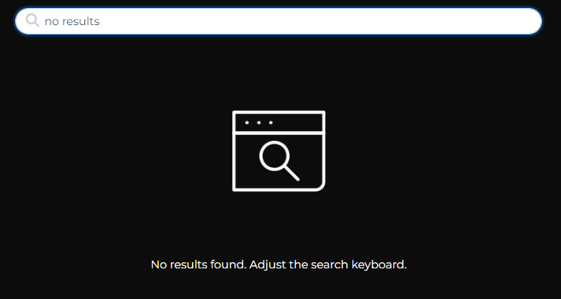

<h1 align="center">ExposePX</h1>

**ExposePX** offers a vibrant online community for photographers, where users can seamlessly interact with each other through various features such as posting pictures, liking, commenting, and following fellow enthusiasts. Additionally, users have the ability to create and join events tailored to the photography scene, fostering connections and collaborations within the art shooting community. The platform also enables users to bookmark events of interest for easy access.

This section of the project is the frontend built to support the Django Rest Framework API from the backend, and it is powered by React Framework.

This project was built as my final Advanced Frontend Portfolio submission for the Diploma in Full Stack Software Development at [Code Institute](https://codeinstitute.net/).

#### DEPLOYED BACKEND API RENDER [LINK](https://p5-drf-api-50dd27c53894.herokuapp.com/)
#### BACKEND GITHUB [REPOSITORY](https://github.com/patthoege/pp5-drf-api)

#### DEPLOYED FRONTEND RENDER [LINK - LIVE SITE]() - to do

 - to do

The live link for **"ExposePX"** can be found [HERE]() - to do

## Table of Contents
+ [UX](#ux "UX")
  + [Site Purpose](#site-purpose "Site Purpose")
  + [Site Goal](#site-goal "Site Goal")
  + [Audience](#audience "Audience")
  + [Communication](#communication "Communication")
  + [Current User Goals](#current-user-goals "Current User Goals")
  + [New User Goals](#new-user-goals "New User Goals")
+ [User Stories](#user-stories "User Stories")
  + [Admin stories](#admin-stories "Admin stories")
  + [User stories](#usert-stories "User stories")
  + [Visitor stories](#visitor-stories "Visitor stories")
+ [Design](#design "Design")
  + [Colour Scheme](#colour-scheme "Colour Scheme")
  + [Typography](#typography "Typography")
  + [Imagery](#imagery "Imagery")
+ [Features](#features "Features")
  + [Existing Features](#existing-features "Existing Features")
  + [C.R.U.D](#crud "C.R.U.D")
+ [Testing](#testing "Testing")
  + [Validator Testing](#validator-testing "Validator Testing")
  + [Unfixed Bugs](#unfixed-bugs "Unfixed Bugs")
+ [Technologies Used](#technologies-used "Technologies Used")
  + [Main Languages Used](#main-languages-used "Main Languages Used")
  + [Frameworks, Libraries & Programs Used](#frameworks-libraries-programs-used "Frameworks, Libraries & Programs Used")
+ [Components](#components "Components")
+ [Deployment](#deployment "Deployment")
+ [Credits](#credits "Credits")
  + [Content](#content "Content")
  + [Media](#media "Media")

## UX

#### Site Purpose:
The purpose of ExposePX is to provide a dynamic online community for photographers, facilitating seamless interaction among users through various features such as photo sharing, liking, commenting, and following other enthusiasts. Additionally, the platform offers the opportunity to create and join photography-related events, fostering connections and collaborations within the photography community.

#### Site Goal:
The primary goal of ExposePX is to create and keep an engaging and user-friendly platform where photographers of all levels can connect, share their work, and participate in events tailored to their interests. The platform aims to provide a space where users can showcase their photography skills, gain inspiration from others, and build meaningful connections within the photography community.

#### Audience:
The target audience for ExposePX includes photography enthusiasts of all skill levels, from amateur photographers looking to improve their skills to professional photographers seeking to showcase their work and network with peers.

#### Communication:
ExposePX communicates its purpose and features through intuitive design, clear navigation, and informative content. The user interface is designed to be visually appealing and easy to navigate, with clear calls-to-action guiding users to key features such as posting photos, joining events, and interacting with other users. Additionally, the platform utilizes clear and concise messaging to inform users about upcoming events, community updates, and any relevant notifications to enhance user engagement and participation.

#### Current User Goals:
- Share photos and receive feedback from the community.
- Discover and participate in photography events.
- Connect with fellow photographers and build a network of like-minded individuals.
- Stay updated on community news, events, and trends in the photography scene.

#### New User Goals:
- Easily sign up and create a profile to start engaging with the community.
- Quickly understand the platform's features and how to navigate them.
- Find inspiration and discover new photography opportunities through the platform.
- Feel welcomed and encouraged to participate in community activities and discussions that the site has to offer.

[Back to top](<#table-of-contents>)

## User Stories

- **User Stories and Issues** (<a href="https://github.com/patthoege/pp5-exposurep/issues?q=is%3Aissue+is%3Aclosed" target="_blank" rel="noopener">GitHub Issues</a>): Project tasks were organized into user stories, each corresponding to specific functionalities or improvements. These user stories were then translated into GitHub issues, providing a clear and manageable way to track progress.

- **MoSCoW Prioritization**: The MoSCoW method was employed to prioritize project requirements and features based on their importance.

- **GitHub Kanban Board** (<a href="https://github.com/users/patthoege/projects/4" target="_blank" rel="noopener">GitHub Project</a>): The GitHub Kanban board was leveraged to visualize and manage the project's workflow. It facilitated the organization of tasks, from backlog to completion, providing a visual representation of the project's status.

[Back to top](<#table-of-contents>)
## Design

### Wireframes:
- A separate document for the wireframes can be viewed here: 
  - [For Desktop view](docs/readme/wireframes/wireframe-desktop.pdf) 
  - [For Mobile view](docs/readme/wireframes/wireframe-mobile.pdf)

### Database Schema:
This has been uploaded to the Backend README, which can be found [HERE](https://github.com/patthoege/pp5-drf-api/#database-schema)

### Colour Scheme:

### Typography:
All fonts were obtained from the Google Fonts library. I chose the following fonts for the page:
1. "Montserrat", sans-serif;

## Features

### Existing Features:
## 1. NavBar
  Includes a responsive navigation bar with the following elements:
  - **Logo:** ExposePX logo with a link to the home page.
  - **Navigation Links:** Home, Events, About, SignIn and SignUp (for non-authenticated users). A Create Post, Add Event, Liked, Saved, SignOut and Profile (for authenticated users).

    

<b> Navbar Non-user Image</b>

    
    
    
 

    

<b>Navbar User Image</b>

    
    
 
## 2. About Page
  The About page serves as a concise guide to ExposePX, detailing its purpose and functionalities. It informs users about the website's features, encourages sign-ups, and provides connection through social media links. Additionally, it includes copyright information.

  

<b>About Us Image</b>

  
  
 

## 3. Landing Page
  Exhibits recent posts by platform users, featuring their avatar images, posting dates, locations, featured images, titles, descriptions, and counts of likes and comments. Additionally, on the right side of the screen, displays the most followed profiles, accompanied by a "Follow" button for users to easily engage with them. Users can utilize a search bar to find posts by username, title or location.

  

<b>Landing Page Image</b>

  
  
 

## 4. Create Post Page
  Provides for authenticated users with a form to upload images and input details such as title, location, and description for their posts.

  

<b>Create Post Page Image</b>

  
  
 

## 5. Add Event Page
  Allows authenticated users to create captivating event listings and invite the community to participate. By filling in event details such as title, content, event link, category, date, time, and place.

  

<b>Add Event Page Image</b>

  
  
 

## 6. Event List Page
  Displays recent events by platform users, featuring their avatar images, posting dates, locations, titles, category, descriptions, event link, date-time, and saved and comment counts.

  

<b>Events Page Image</b>

  
  
 

## 7. Liked Page
  Enables users to conveniently access a list of recently liked posts, helping them keep track of their favorite content.

  

<b>Liked Page Image</b>

  
  
 

## 8. Saved Page
  Allows users to conveniently access a list of recently saved events, helping them manage and keep track of their interests and plans.

  

<b>Saved Page Image</b>

  
  
 

## 9. Single Post & Event Pages
  These pages offer detailed information about a specific post or event, providing users with the functionality to leave comments on the existing content.

  

<b>Single Post Page Image</b>

  
  
 

  

<b>Single Event Page Image</b>

  
  
 

## 10. SignIn & SignUp Pages
  

  

<b>SignIn Page Image</b>

  
  
 

  

<b>SignUp Page Image</b>

  
  
 

## 11. No Results & 404 Pages
  

  

<b>No Results Page Image</b>

  
  
 

  

<b>404 Not Found Page Image</b>

  
  
 

[Back to top](<#table-of-contents>)

### Future Features Left to Implement:
- Implement a private messaging system that allows users to engage in one-on-one conversations or group discussions. 
- Integrating Google Maps into the events and post sections, providing users with comprehensive location details, allowing them to visualize where a photo was taken or where an event is scheduled to take place.
- Implement like and reply comments to enable users to engage in specific conversations within a thread. 

[Back to top](<#table-of-contents>)

## Testing
This project has been continuously tested throughout the development stages

### Manual Testing:
A separate document for testing can be viewed here: [TESTING.md](docs/readme/TESTING.md)